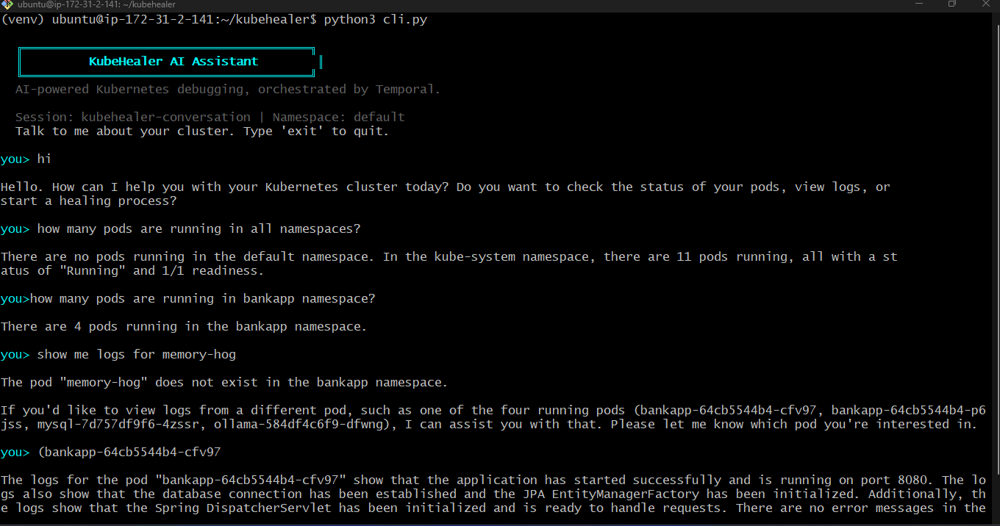
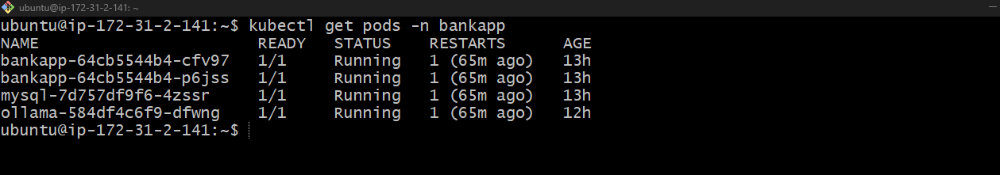
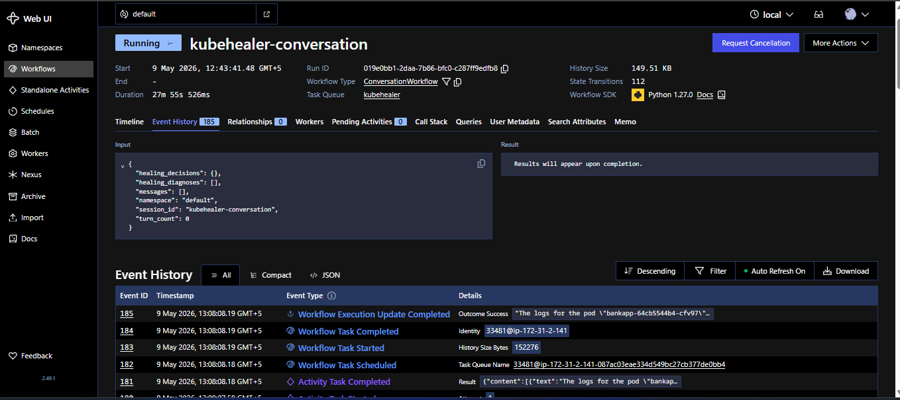

# 🩺 KubeHealer

> **AI-powered Kubernetes debugging and auto-remediation, orchestrated by Temporal.**


An AI agent that **finds broken Kubernetes pods**, **diagnoses them with LLM**, and **fixes them automatically** — orchestrated by Temporal for durable, crash-proof execution.

---

## 📸 Screenshots

### 🤖 KubeHealer AI Chat — Real Cluster Interaction

> AI assistant answering real questions about the cluster — pod counts, logs, status — all from live Kubernetes data.

### ☸️ kubectl — All Pods Running in BankApp Namespace

> 4 pods healthy and running in the `bankapp` namespace after KubeHealer diagnosed and healed the cluster.

### ⏱️ Temporal Dashboard — Workflow Event History

> Every AI call, every tool call, every fix — stored in Temporal's event history. 185 events, fully observable and crash-proof.

---

## 🧠 How It Works

```
1. SCAN     →  Finds unhealthy pods (CrashLoopBackOff, OOMKilled, ImagePullBackOff...)
2. DIAGNOSE →  Sends pod details to LLM, gets root cause + fix plan
3. FIX      →  Executes remediation (restart, patch image, adjust resources)
```

Everything runs inside **Temporal workflows** = crash-proof, retryable, fully observable.

---

## 🎯 What Gets Fixed

| Broken App | Problem | AI Diagnosis | Auto-Fix |
|---|---|---|---|
| `web-app` | Image `nginx:latestt` (typo) | Detects typo | Patches to `nginx:latest` |
| `memory-hog` | 10Mi limit + stress 100M | OOMKilled | Patches to `256Mi` |
| `config-app` | Missing ConfigMap | Can't auto-fix | Skips with explanation |

---

## 🚀 Two Modes

### 1️⃣ Interactive — Conversational AI Agent
```bash
python cli.py
```
Chat naturally with your cluster:
```
you> how many pods are running?
you> what's wrong with web-app?
you> show me the logs for memory-hog
you> heal my cluster
you> approve all fixes
```
> Every message, every AI response, every tool call is stored in Temporal's event history.
> Kill the CLI or worker mid-conversation — restart and it picks up **exactly where it left off**.

### 2️⃣ Auto-heal — One Shot
```bash
python starter.py
```
Scans, diagnoses, and fixes everything automatically. No interaction needed.

---

## 🏗️ Architecture

```
CLI (thin terminal)                    Temporal Worker
  |                                         |
  |-- update(send_message, "how many") --->|
  |                                    ConversationWorkflow
  |                                    ├─ activity: call_llm
  |                                    ├─ activity: list_pods       (tool call)
  |                                    ├─ activity: call_llm        (with tool result)
  |                                    └─ returns response via update
  |<-- "I see 5 pods running..." ----------|
  |                                         |
  |-- update(send_message, "heal it") ---->|
  |                                    ├─ activity: call_llm → tool: start_healing
  |                                    ├─ activity: scan_cluster
  |                                    ├─ activity: get_pod_details (x3)
  |                                    ├─ activity: diagnose_pod    (x3)
  |                                    ├─ activity: call_llm → "Found 3 issues..."
  |<-- response with diagnoses ------------|
```

---

## ⚡ Quick Start

### Prerequisites
- Python 3.11+
- Docker
- Kind
- Temporal CLI
- Groq API key (free at [console.groq.com](https://console.groq.com))

### Installation

**Terminal 1 — Kubernetes cluster setup:**
```bash
git clone https://github.com/haideralimazari/kubehealer.git
cd kubehealer
./setup.sh
```

**Terminal 2 — Temporal server:**
```bash
temporal server start-dev
```

**Terminal 3 — Install dependencies & start worker:**
```bash
python3 -m venv venv
source venv/bin/activate
pip install -r requirements.txt
cp .env.example .env   # Add your GROQ_API_KEY
python worker.py
```

**Terminal 4 — Start chatting:**
```bash
source venv/bin/activate
python cli.py
```

Open **http://localhost:8233** to see the workflow trace in Temporal UI.

---

## 🔑 Key Design Decisions

| Decision | Why |
|---|---|
| **Temporal Updates** (not signal+query) | CLI sends a message and blocks until full agentic loop completes. No polling. Response comes back directly. |
| **Each LLM call = separate activity** | Individually retryable, visible in Temporal UI, different timeouts per tool. |
| **Continue-as-new at 50 turns** | Prevents unbounded event history. |
| **Fixed workflow ID** | CLI reconnects to the same conversation after crash. |

---

## 🛠️ Tech Stack

| Component | Role |
|---|---|
| **Temporal** | Durable workflow orchestration |
| **Groq / LLaMA 3.3** | LLM diagnosis + conversational agent |
| **Kubernetes** | Target environment |
| **Kind** | Local K8s cluster |
| **Python** | Everything glued together |

---

## 📁 Project Structure

```
kubehealer/
├── activities/
│   ├── chat_activities.py    # LLM + K8s tool activities
│   ├── k8s_activities.py     # Kubernetes operations
│   └── llm_activities.py     # Pod diagnosis with LLM
├── workflows/
│   ├── conversation_workflow.py  # Interactive chat workflow
│   └── healer_workflow.py        # Auto-heal workflow
├── k8s/                      # Broken pods for demo
├── cli.py                    # Terminal chat interface
├── worker.py                 # Temporal worker
├── starter.py                # Auto-heal one-shot
└── models.py                 # Data models
```

## 📚 What I Learned Building This Project

Building KubeHealer was a hands-on journey through modern DevOps and AIOps. Here's what I gained:

### ☸️ Kubernetes
- How pods crash and why — `CrashLoopBackOff`, `OOMKilled`, `ImagePullBackOff`
- Reading pod events, logs, and container statuses with `kubectl`
- Patching deployments programmatically using the Kubernetes Python SDK
- Setting up local clusters with **Kind** (Kubernetes in Docker)
- Working with Namespaces, PVCs, ConfigMaps, Secrets, and Services

### ⏱️ Temporal — Durable Workflow Orchestration
- What durable execution means and why it matters in production
- Designing **Workflows** and **Activities** separately for retryability
- Using **Temporal Updates** for real-time request-response patterns
- `continue-as-new` pattern to prevent unbounded event history
- Observing full workflow history in the **Temporal UI dashboard**

### 🤖 AI Agents & LLM Integration
- Building a real **agentic loop** — LLM calls tools, gets results, calls again
- Integrating **Groq API** (LLaMA 3.3) as a free, fast LLM backend
- Designing tool schemas for function calling
- Parsing and validating structured JSON responses from LLMs
- Replacing one LLM provider with another (Anthropic → Groq) with minimal changes

### 🐍 Python & Software Engineering
- Async Python with `asyncio` for concurrent activities
- Building CLI interfaces with real-time streaming responses
- Environment management with `.env` files and `python-dotenv`
- Virtual environments (`venv`) for dependency isolation
- Debugging complex distributed systems across multiple terminals

### 🏗️ DevOps & AIOps Concepts
- What **AIOps** means — AI + Operations working together
- How AI can replace manual on-call debugging at 2 AM
- Crash-proof system design — what happens when a process dies mid-task
- Observability — every action logged, traced, and replayable
- Infrastructure as Code with Kind cluster configuration


> 🚀 *"AI that heals your cluster so you can sleep at night."*


